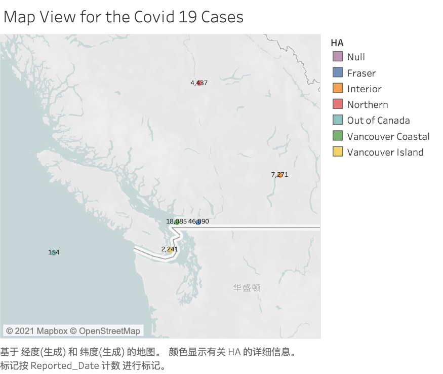
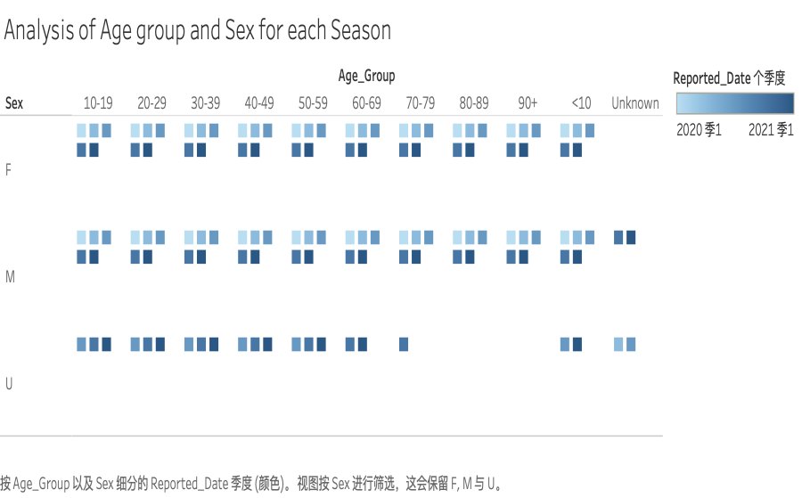

# Covid-19 Track Dashboard

At very beginning of the pendemic, I want to use the information that displayed on BC CDC website to bulid a dashboard that can easily show the case number and alert people to avoid the place that may contain risks with Covid-19. However, due to the information restrict, the code has been changed a little.

## Use of the Packages: 

The main language I used is Python with the request and beautifulsoup module. The other help tools is Tableau to display the data in map. 

## Process of the Display: 
1. Get the Data from BC CDC:
  a). Test the request and beautifulsoup module are successful link the website
  b). Download the dataset from CDC website. The download dataset are named: "1.csv". (The name are using for test currently) 

2. Using the Tableau to display the data on the map 

3. Using the python to analysis the data (Current Working) 
4. Using D3 to build to visulization dashboard for the data. (Future working, estimated complete on April)

### Get the Data from website:
The origin website create by BC CDC is: 

The python notebook script are [here](./Scraping the COVID-19 Data from Official Website.ipynb)

### Tableau 
This is a project that create by Tableau, some analysis are create. The Tableau worksite is [here](./COVID19_Data/Covid-19.twb). You can download the Tableau file for more details. The Tableau is using verison 2020.4 with the student license.

#### Maps
The maps are showing below: the data are updated to Feb 25th 2021. 

Due to the Tableau do not have specific map for the Canada site, so the region could not be clearly define, however, currently I find a solution for it by using polygon maps, will update later.

#### Analysis
The Analysis are showing below: The data are updated to Feb 25th 2021.

The result are showing all the sex, all the age group are having increace number of cases recently. People Should BE CAREFUL about this situation!!!

